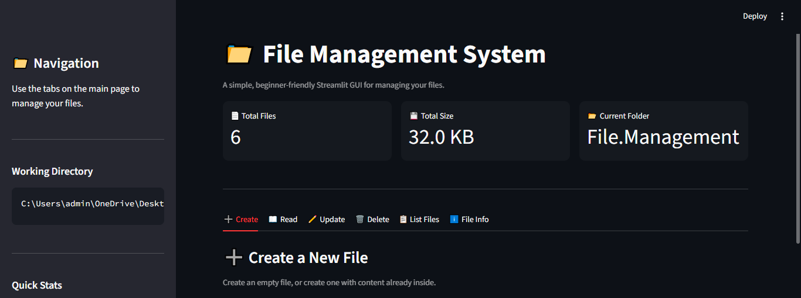

# File Management System

A Python-based File Management System with both a Command-Line Interface (CLI) and an interactive Streamlit-based Graphical User Interface (GUI).

The project allows users to create, read, update, delete, list, and view information about files using Python's built-in `pathlib` module.

## Features

- Create a new file
- Create an empty file or add content while creating
- Read file contents
- Rename files
- Append content to existing files
- Replace/overwrite file contents
- Delete files
- List all files in the current directory
- Display file information
- Input validation and error handling
- Modular code structure
- Interactive Streamlit GUI
- Dashboard with file statistics
- File selection through dropdowns

## Technologies Used

- Python
- pathlib
- Streamlit
- File Handling
- Exception Handling
- Functions
- Modules
- Git & GitHub

## Project Structure

File-management-project/
│
├── File_Operations.py
├── Main.py
├── GUI.py
├── README.md
├── requirements.txt
└── .gitignore

## Main.py

Contains the main menu and controls the flow of the command-line version of the program.

## File_Operations.py

Contains the functions responsible for file operations such as creating, reading, updating, deleting, listing files, and displaying file information.

## GUI.py

Contains the Streamlit-based graphical user interface for interacting with the File Management System through a web browser.

## How to Run

Run the CLI Version:

Run the following command in the project directory:
python Main.py

The CLI provides the following options:

- Create file
- Read file
- Update file
- Delete file
- List files
- Display file information
- Exit

Run the Streamlit GUI:

First, install the required dependencies:
pip install -r requirements.txt

Then run the Streamlit application:
streamlit run GUI.py

The application will open in your web browser.

## GUI Preview

## Live Demo

[Click here to try the File Management System](https://pncz7vrzhvatwghgqqelvp.streamlit.app/)

## Concepts Practiced

This project helped me practice:

-Python functions
- File handling
- pathlib
- Exception handling
- User input validation
- Loops and conditional statements
- Python modules and imports
- Basic project organization
- Git and GitHub
- Building a Streamlit GUI
- Future Improvements

## Possible future improvements include:

- Search files by name
- Copy and move files
- Better formatted file information
- Unit testing
- Support for multiple directories

## Author

Soumya